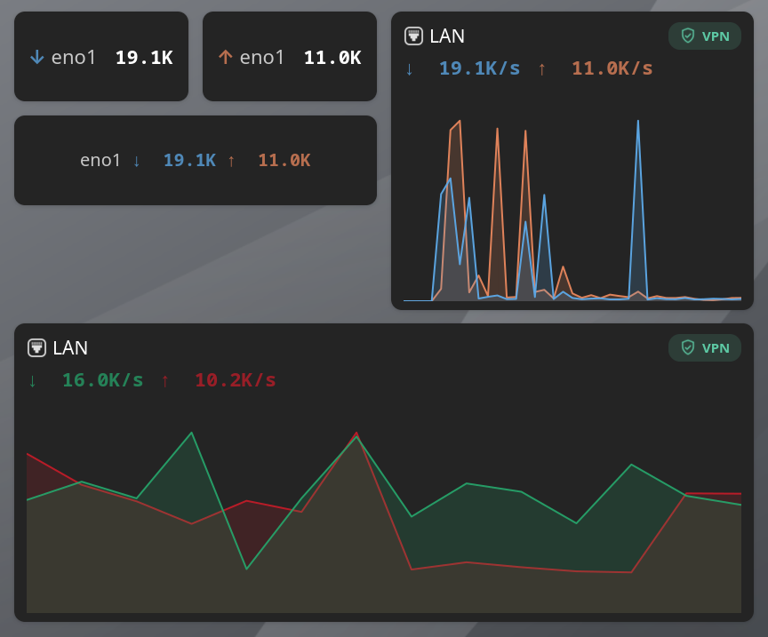
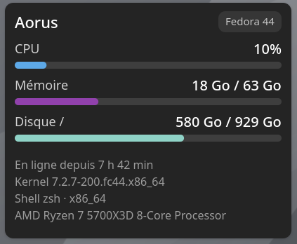

<div align="center">

[🇫🇷 Français](README.md) · 🇬🇧 English

# 🖥️ Xeneon Dashboard

[](LICENSE)
[](https://github.com/Argon-Black/xeneon/actions/workflows/ci.yml)

**A native touch dashboard for the Corsair iCUE Xeneon Edge secondary display, written in Rust/GTK4.**

*Clock, calendar, weather, media player, temperatures, app shortcuts, embedded YouTube browser — organized into swipeable pages, customizable down to the pixel.*

</div>

---

## Why this project

The [Corsair iCUE Xeneon Edge](https://www.corsair.com/) is a 14.5" secondary touchscreen (2560×720, ultra-wide format) shipped with a fairly limited Windows/iCUE-only official software and no real Linux support. This project replaces that software with a native dashboard, designed from the ground up for this specific screen: grid dimensions computed for its physical panel, touch targets sized for a finger rather than a mouse cursor, and interactions designed for a secondary screen you glance at rather than a primary workstation.

The project started in Python/GTK (see the Git history), then was **fully ported to Rust** on [Relm4](https://relm4.org/) for the robustness and performance of a real native binary running continuously alongside the workstation.

## Screenshots

**Overview** — clock, calendar, weather, audio player (MPRIS), temperature gauge and shortcuts grid:


**YouTube widget** — embedded WebKitGTK mini-browser, free navigation:


**Network widget** — ↓/↑ throughput per interface, Wi-Fi/Ethernet/VPN detection, history graph (SSX, SX, S, SQ, M sizes):



**System info widget** — CPU, memory, disk, hostname, OS, uptime, kernel, shell and CPU model, customizable gauges and colors:



**Settings** — interface, pages, default widget appearance, keyboard shortcuts:


## Features

### Widgets

| Widget | Description |
| --- | --- |
| 🕐 **Clock** | Flip-clock-style time, city and date (short or long format), customizable font/color. |
| 📅 **Calendar** | Monthly calendar with `.ics` calendar import, including **recurring events** (RFC 5545 via [`rrule`](https://crates.io/crates/rrule)), click/hover event details. |
| 🌦️ **Weather** | Current conditions (temperature, humidity, pressure, wind, UV index) via [Open-Meteo](https://open-meteo.com/), free-text city search, °C/°F toggle. |
| 🎵 **Audio** | Plexamp-inspired "now playing" card for **any media player** exposing the standard [MPRIS](https://specifications.freedesktop.org/mpris-spec/latest/) interface — album art, transport controls, clickable progress bar. |
| 🌡️ **Temperature** | Direct reading of kernel `hwmon` sensors (CPU, GPU, motherboard...), as a circular gauge or compact text, with automatic or manual sensor selection. |
| 📺 **YouTube** | A real WebKitGTK mini-browser pointed at youtube.com — free navigation, not a widget locked to a single channel/video. |
| 🚀 **Shortcuts** | Launcher grid (up to 5×5) for installed applications, with touch-based icon reordering. |
| 🌐 **Network** | Live ↓/↑ throughput per interface (direct `/proc/net/dev`/`/proc/net/route` reads, no dependency), automatic Wi-Fi/Ethernet and VPN detection, history graph and customizable colors on the SQ/M sizes. |
| 🖥️ **System info** | CPU, memory, disk, hostname, OS, uptime, kernel, shell and CPU model (direct `/proc`, `/sys` and `statvfs` reads, no dependency beyond `libc`), customizable gauges and colors (SQ size). |

Each widget has its own appearance panel (colors, fonts, content sizes) and comes in one or more fixed sizes (S, M, L, SQ, SX...) that combine to fill the page grid — no free resizing, only presets that snap together cleanly.

### Interface

- **Swipeable carousel pages**, with a touch-friendly page indicator that fades when idle.
- **Drag and drop with grid snapping**, automatic free-space search.
- **Fullscreen** (F11), designed to run continuously on the physical panel.
- **System tray icon** (via [`ksni`](https://crates.io/crates/ksni)): add a widget, settings, help, relaunch, quit.
- **Light/dark theme** and customizable accent color.
- **Internationalization**: French and English, hot-swappable.
- **Automatic persistence** of the layout (pages, widgets, settings) as JSON.

### Keyboard shortcuts

| Key | Action |
| --- | --- |
| `F11` | Fullscreen |
| `Ctrl + Shift + A` | Add a widget |
| `Ctrl + ,` | Go to settings |
| `Esc` | Close the active overlay window |

## Architecture

The project is a two-crate Cargo workspace:

```
xeneon-dashboard-rs/
├── xeneon-core/   # Pure logic: grid, positioning, i18n, persistence,
│                  # widget/page state — zero GTK dependency, testable
│                  # without a display.
└── xeneon-app/    # Relm4/GTK4/libadwaita UI, each widget under
                    # src/widgets/, tray, appearance popovers, i18n runtime.
```

This separation keeps as much logic as possible (grid math, snap arithmetic, iCal parsing...) testable without depending on a graphical environment.

## Tech stack / dependencies

Written in **Rust** (2024 edition), on top of:

- [**Relm4**](https://relm4.org/) — reactive application framework on top of GTK4 (`gnome_47`, `libadwaita`).
- **GTK4** / **libadwaita** — modern GNOME graphical toolkit and widgets.
- **WebKitGTK** — rendering engine for the YouTube widget.
- [`ksni`](https://crates.io/crates/ksni) — StatusNotifierItem (system tray) icon via D-Bus.
- [`rrule`](https://crates.io/crates/rrule) — calendar event recurrence (RFC 5545).
- [`chrono`](https://crates.io/crates/chrono) / `chrono-tz` — dates, times, timezones.
- [`ureq`](https://crates.io/crates/ureq) — minimal HTTP client (weather calls).
- `serde` / `serde_json` — configuration serialization.
- `uuid` — persisted widget/page identifiers.

Deliberate choice: **minimal dependencies**. Whenever possible, the project relies on system interfaces that are already available rather than adding a library — MPRIS and the tray via D-Bus (already provided by `gtk4`/`libadwaita`), temperatures via direct `/sys/class/hwmon` reads, rather than dedicated crates.

## Building

### System requirements

You need the GTK4, libadwaita and WebKitGTK development libraries. On Fedora:

```bash
sudo dnf install rust cargo gtk4-devel libadwaita-devel webkitgtk6.0-devel
```

On Debian/Ubuntu (equivalent package names, versions may vary by release):

```bash
sudo apt install rustc cargo libgtk-4-dev libadwaita-1-dev libwebkitgtk-6.0-dev
```

### Build and run

```bash
cd xeneon-dashboard-rs
cargo build --release
cargo run --release -p xeneon-app
```

### Tests

The pure logic in `xeneon-core` (grid positioning, snapping, parsing) is covered by unit tests:

```bash
cargo test -p xeneon-core
```

## Configuration

The layout (pages, widgets, settings) is automatically persisted, one JSON file per page/widget, under:

```
$XDG_CONFIG_HOME/xeneon-dashboard-rs/
├── config.json
├── pages/
└── widgets/
```

(Distinct from the `xeneon-dashboard` directory used by the old Python version, so both can coexist without conflict.)

## Project status

- ✅ Full port from the Python version to Rust/Relm4 (`rust-gtk-port` branch).
- 🚧 Flatpak packaging under consideration, currently paused.

## License

Copyright © 2026 Argon

Distributed under the [GPL-3.0](LICENSE) license.
