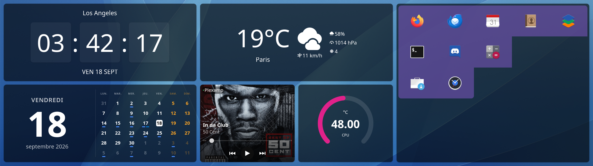
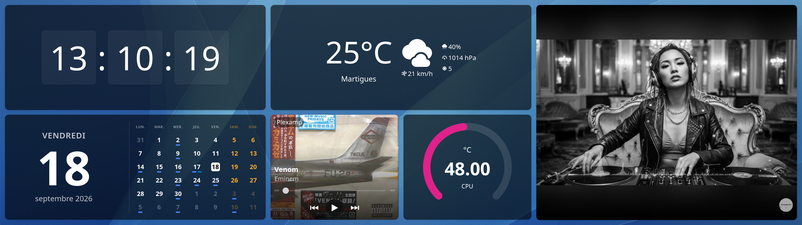
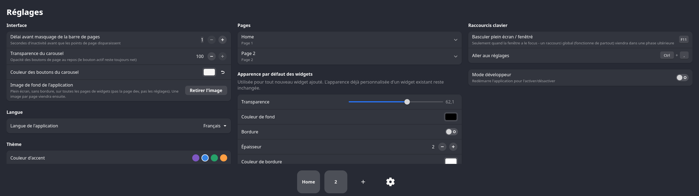

<div align="center">

# 🖥️ Xeneon Dashboard

[](LICENSE)

**Un tableau de bord tactile natif pour l'écran secondaire Corsair iCUE Xeneon Edge, écrit en Rust/GTK4.**

*Horloge, agenda, météo, lecteur média, températures, raccourcis d'applications, navigateur YouTube intégré — organisés en pages glissables, personnalisables au pixel près.*

</div>

---

## Pourquoi ce projet

Le [Corsair iCUE Xeneon Edge](https://www.corsair.com/) est un écran tactile secondaire de 14,5" (2560×720, format ultra-large) livré avec un logiciel officiel Windows/iCUE assez limité et sans réel support Linux. Ce projet remplace ce logiciel par un dashboard natif, pensé dès le départ pour cet écran précis : dimensions de grille calculées pour son panneau physique, cibles tactiles dimensionnées pour un doigt et non un curseur de souris, et une interaction pensée pour un second écran qu'on consulte du coin de l'œil plutôt qu'un poste de travail principal.

Le projet a démarré en Python/GTK (voir l'historique Git), puis a été **entièrement porté en Rust** sur [Relm4](https://relm4.org/) pour la robustesse et les performances d'un vrai binaire natif tournant en continu à côté du poste de travail.

## Captures d'écran

**Vue d'ensemble** — horloge, agenda, météo, lecteur audio (MPRIS), jauge de température et grille de raccourcis :



**Widget YouTube** — mini-navigateur WebKitGTK intégré, navigation libre :



**Réglages** — interface, pages, apparence par défaut des widgets, raccourcis clavier :



## Fonctionnalités

### Widgets

| Widget | Description |
| --- | --- |
| 🕐 **Horloge** | Heure façon "flip-clock", ville et date (format court ou long), police/couleur personnalisables. |
| 📅 **Agenda** | Calendrier mensuel avec import d'agendas `.ics`, y compris les **événements récurrents** (RFC 5545 via [`rrule`](https://crates.io/crates/rrule)), détail au clic/survol. |
| 🌦️ **Météo** | Conditions actuelles (température, humidité, pression, vent, indice UV) via [Open-Meteo](https://open-meteo.com/), recherche de ville libre, bascule °C/°F. |
| 🎵 **Audio** | Carte "now playing" façon Plexamp pour **n'importe quel lecteur média** exposant l'interface standard [MPRIS](https://specifications.freedesktop.org/mpris-spec/latest/) — pochette, transport, barre de progression cliquable. |
| 🌡️ **Température** | Lecture directe des capteurs `hwmon` du noyau (CPU, GPU, carte mère...), en jauge circulaire ou en texte compact, avec sélection automatique ou manuelle du capteur. |
| 📺 **YouTube** | Un vrai mini-navigateur WebKitGTK pointé sur youtube.com — navigation libre, pas un widget figé sur une chaîne/vidéo unique. |
| 🚀 **Raccourcis** | Grille de lancement (jusqu'à 5×5) pour les applications installées, avec réorganisation tactile des icônes. |

Chaque widget dispose de son propre panneau d'apparence (couleurs, polices, tailles de contenu) et se décline en un ou plusieurs formats fixes (S, M, L, SQ, SX...) qui se combinent pour remplir la grille de la page — pas de redimensionnement libre, uniquement des presets qui s'emboîtent proprement.

### Interface

- **Pages en carrousel** glissables, avec indicateur de pages tactile qui s'estompe au repos.
- **Glisser-déposer avec accroche (snap) à la grille**, recherche automatique de place libre.
- **Plein écran** (F11), pensé pour tourner en continu sur le panneau physique.
- **Icône de barre système** (via [`ksni`](https://crates.io/crates/ksni)) : ajouter un widget, réglages, aide, relancer, quitter.
- **Thème clair/sombre** et couleur d'accentuation personnalisable.
- **Internationalisation** : français et anglais, changement à chaud.
- **Persistance** automatique de la disposition (pages, widgets, réglages) en JSON.

### Raccourcis clavier

| Touche | Action |
| --- | --- |
| `F11` | Plein écran |
| `Ctrl + Maj + A` | Ajouter un widget |
| `Ctrl + ,` | Aller aux réglages |
| `Échap` | Fermer la fenêtre superposée active |

## Architecture

Le projet est un workspace Cargo à deux crates :

```
xeneon-dashboard-rs/
├── xeneon-core/   # Logique pure : grille, positionnement, i18n, persistance,
│                  # état des widgets/pages — zéro dépendance GTK, testable
│                  # sans affichage.
└── xeneon-app/    # Interface Relm4/GTK4/libadwaita, chaque widget dans
                    # src/widgets/, tray, popovers d'apparence, i18n runtime.
```

Cette séparation permet de tester au maximum de logique (calculs de grille, arithmétique de snap, parsing iCal...) sans dépendre d'un environnement graphique.

## Stack technique / dépendances

Écrit en **Rust** (édition 2024), sur les fondations suivantes :

- [**Relm4**](https://relm4.org/) — framework applicatif réactif au-dessus de GTK4 (`gnome_47`, `libadwaita`).
- **GTK4** / **libadwaita** — toolkit graphique et widgets GNOME modernes.
- **WebKitGTK** — moteur de rendu pour le widget YouTube.
- [`ksni`](https://crates.io/crates/ksni) — icône StatusNotifierItem (barre système) via D-Bus.
- [`rrule`](https://crates.io/crates/rrule) — récurrence d'événements calendrier (RFC 5545).
- [`chrono`](https://crates.io/crates/chrono) / `chrono-tz` — dates, heures, fuseaux.
- [`ureq`](https://crates.io/crates/ureq) — client HTTP minimal (appels météo).
- `serde` / `serde_json` — sérialisation de la configuration.
- `uuid` — identifiants des widgets/pages persistés.

Choix assumé : **dépendances minimales**. Chaque fois que c'est possible, le projet passe par des interfaces système déjà disponibles plutôt que d'ajouter une bibliothèque — MPRIS et le tray via D-Bus (déjà fourni par `gtk4`/`libadwaita`), températures via lecture directe de `/sys/class/hwmon`, plutôt que des crates dédiées.

## Compilation

### Prérequis système

Il faut les bibliothèques de développement GTK4, libadwaita et WebKitGTK. Sur Fedora :

```bash
sudo dnf install rust cargo gtk4-devel libadwaita-devel webkitgtk6.0-devel
```

Sur Debian/Ubuntu (noms de paquets équivalents, versions à adapter selon la distribution) :

```bash
sudo apt install rustc cargo libgtk-4-dev libadwaita-1-dev libwebkitgtk-6.0-dev
```

### Build et exécution

```bash
cd xeneon-dashboard-rs
cargo build --release
cargo run --release -p xeneon-app
```

### Tests

La logique pure de `xeneon-core` (positionnement de grille, snap, parsing) est couverte par des tests unitaires :

```bash
cargo test -p xeneon-core
```

## Configuration

La disposition (pages, widgets, réglages) est persistée automatiquement, un fichier JSON par page/widget, sous :

```
$XDG_CONFIG_HOME/xeneon-dashboard-rs/
├── config.json
├── pages/
└── widgets/
```

(Répertoire distinct de `xeneon-dashboard` utilisé par l'ancienne version Python, pour pouvoir cohabiter sans conflit.)

## État du projet

- ✅ Port complet de la version Python vers Rust/Relm4 (branche `rust-gtk-port`).
- 🚧 Empaquetage Flatpak à l'étude, en pause.

## Licence

Copyright © 2026 Argon

Distribué sous licence [GPL-3.0](LICENSE).
